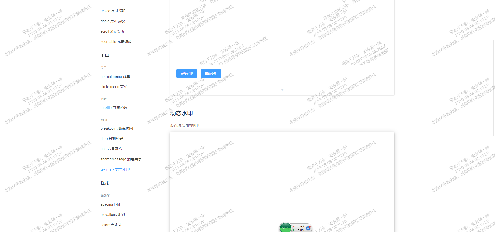

### 描述
文字水印


### Constructor
```
Textmark(options: Options, container: HTMLElement | CssSelector);

interface Options {
            text: string[] | string   //                水印文字
            fontSize: number;      // default 16        字体大小
            fontWeight: number | string; // defalt normal  字体粗细
            lineHeight: number;    // default 1.25      文字行高
            bias: number;          // default -30       旋转角度
            spacingX: number;      // default 100       横向间距
            spacingY: number;      // default 25        纵向间距
            opacity: number;       // default 0.25      水印透明度
            color: string;         // default '#000000' 文字颜色
}
```
